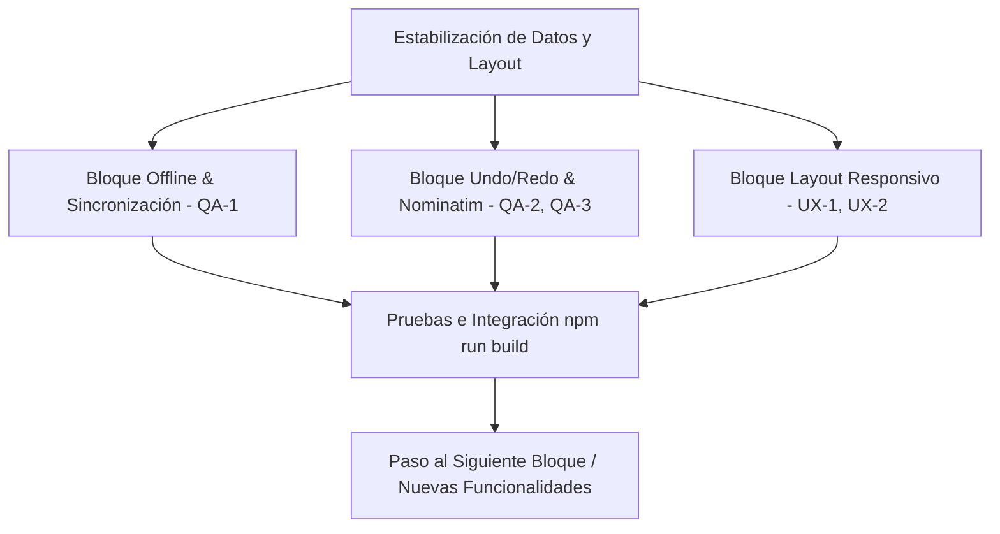

# 📋 Estado del Proyecto - SummitGPS

Este documento consolida y prioriza todas las tareas, errores y sugerencias de mejora identificados en las auditorías de **Garantía de Calidad (QA)**, **Diseño UX/UI** y **Gestión de Producto (PM)**. Su objetivo es servir como la fuente única de verdad para el desarrollo, seguimiento de estado y asignación de tareas en SummitGPS.

---

## 🚦 Resumen del Estado de Tareas

| Prioridad | Total Tareas | Pendientes | En Progreso | Completadas |
| :--- | :---: | :---: | :---: | :---: |
| 🔴 **Crítico** | 5 | 5 | 0 | 0 |
| 🟡 **Alto** | 2 | 2 | 0 | 0 |
| 🟢 **Medio** | 5 | 5 | 0 | 0 |
| 🔵 **Bajo** | 4 | 4 | 0 | 0 |
| **Total** | **16** | **16** | **0** | **0** |

---

## 🛠️ Backlog Unificado y Priorizado

### 🔴 Prioridad: Crítico (Bloquea estabilidad de datos o usabilidad básica)

| ID | Origen | Tarea / Bug | Descripción | Estado | Asignado a |
| :--- | :--- | :--- | :--- | :---: | :--- |
| **QA-1** | QA | **Pérdida de datos offline** | Al reconectarse y refrescar, si existen rutas en la nube (`dbTracks.length > 0`), el cliente sobrescribe `localStorage` con la base de datos desactualizada, borrando las rutas creadas/editadas sin conexión. | 🔴 Pendiente | `desarrollador_core` |
| **QA-2** | QA | **Condición de carrera Undo/Redo** | Supabase ejecuta `.delete()` + `.insert()` asíncronos en deshacer/rehacer. Pulsaciones rápidas desordenan peticiones en red, causando violaciones de clave primaria e inconsistencias de estado. | 🔴 Pendiente | `desarrollador_core` |
| **QA-3** | QA | **Límite de peticiones de Nominatim** | El arrastre de Street View tiene un debounce de 400ms. Si es continuo, supera el límite de 1 petición/s de Nominatim, devolviendo HTTP 429 y arriesgando bloqueo de IP. | 🔴 Pendiente | `desarrollador_core` |
| **UX-1** | UX | **Desbordamiento Point Info Drawer** | En pantallas móviles/tablets (<768px), el panel se desborda lateralmente al usar `left: isSidebarCollapsed ? 64 : 380` con ancho rígido. | 🔴 Pendiente | `ux_designer` |
| **UX-2** | UX | **Colisión Perfil Elevación / Sidebar** | En portátiles de 13" o iPads horizontales, el perfil de elevación colisiona visualmente con el sidebar expandido (380px), tapando controles del mapa. | 🔴 Pendiente | `ux_designer` |

### 🟡 Prioridad: Alto (Funcionalidades clave o problemas operativos importantes)

| ID | Origen | Tarea / Bug | Descripción | Estado | Asignado a |
| :--- | :--- | :--- | :--- | :---: | :--- |
| **PM-1** | PM | **Modo Fuera de Línea (Offline Maps)** | Implementar caché de teselas de mapas y almacenamiento IndexedDB de la ruta activa mediante PWA para uso seguro en montaña sin cobertura. | 🟡 Pendiente | `desarrollador_offline` |
| **QA-6** | QA | **Trazado caótico en Relaciones OSM** | Si una ruta de OSM está fragmentada o desordenada (o incluye sub-relaciones como senderos GR), la importación dibuja líneas en zigzag caóticas en el mapa. | 🟡 Pendiente | `desarrollador_core` |

### 🟢 Prioridad: Medio (Mejoras de usabilidad e interactividad)

| ID | Origen | Tarea / Bug | Descripción | Estado | Asignado a |
| :--- | :--- | :--- | :--- | :---: | :--- |
| **UX-3** | UX | **Interactividad en Perfil Combinado** | El componente `CombinedElevationProfile.tsx` es un gráfico estático. Requiere interactividad de hover sincronizado con el mapa y zoom al seleccionar rango (`fitBounds`). | 🟢 Pendiente | `ux_designer` |
| **QA-4** | QA | **Fallback vacío de Wikipedia** | Manejo de respuestas de Wikipedia usa `.catch(() => {})`. Si falla la red o CORS, el spinner desaparece y muestra "No se encontraron artículos cercanos" erróneamente. | 🟢 Pendiente | `desarrollador_core` |
| **QA-5** | QA | **Falta de feedback Overpass en 3D** | El visor 3D solo conecta al servidor principal de Overpass (sin usar los 4 respaldos del sidebar). Si cae, no se cargan los refugios y no hay feedback de error. | 🟢 Pendiente | `desarrollador_core` |
| **QA-7** | QA | **Filtro estricto de GraphHopper/OSRM** | El verificador de fallbacks descarta la ruta si el trazado calculado supera por 3 el trazado lineal directo. En montañas sinuosas, esto obliga a trazar líneas rectas erróneas. | 🟢 Pendiente | `desarrollador_core` |
| **PM-2** | PM | **Buscador Social de Rutas** | Desarrollar una galería y mapa de descubrimiento para que los usuarios busquen y exploren rutas públicas (`is_public = true`) de otros miembros. | 🟢 Pendiente | `desarrollador_social` |

### 🔵 Prioridad: Bajo (Estética, accesibilidad o mejoras menores)

| ID | Origen | Tarea / Bug | Descripción | Estado | Asignado a |
| :--- | :--- | :--- | :--- | :---: | :--- |
| **UX-4** | UX | **Carga cognitiva en dibujo** | Controles dispersos: botón "Finalizar" abajo en el mapa, y botones "Deshacer" y "Limpiar" en la barra lateral izquierda. | 🔵 Pendiente | `ux_designer` |
| **UX-5** | UX | **Accesibilidad: Tipografía pequeña** | Uso de clases CSS con tipografía excesivamente pequeña (`text-[8.5px]`, `text-[8px]`) en tablas de datos secundarios. | 🔵 Pendiente | `ux_designer` |
| **UX-6** | UX | **Accesibilidad: Contraste insuficiente** | El texto gris claro (`#64748b`) sobre fondo verde oscuro tiene un contraste de 2.5:1 (requiere 4.5:1 para WCAG 2.1 AA), dificultando su lectura bajo luz solar. | 🔵 Pendiente | `ux_designer` |
| **PM-3** | PM | **Detección de Rampas (ClimbPro)** | Análisis automático de pendientes coloreando la ruta y el perfil según la inclinación (de verde a negro) estilo Garmin ClimbPro. | 🔵 Pendiente | `desarrollador_core` |

---

## 🚀 Primer Bloque de Trabajo (Sprint 1)

El primer bloque de trabajo se centrará exclusivamente en la resolución de los **5 errores Críticos (QA-1, QA-2, QA-3, UX-1, UX-2)**. Estos fallos impactan de manera directa en la experiencia de usuario y en la seguridad de los datos almacenados de forma local y remota.

### 📋 Detalle del Plan de Acción Inicial:

1. **Fase 1: Corrección de Pérdida de Datos Offline (QA-1)**
   * **Objetivo:** Modificar el flujo de sincronización inicial en la carga de la aplicación.
   * **Estrategia:** En lugar de sobrescribir a ciegas el `localStorage` cuando `dbTracks.length > 0` al volver a estar online, implementaremos una estrategia de fusión (merge) inteligente o consultaremos al usuario si desea conservar el trabajo sin conexión local antes de actualizar.
 
2. **Fase 2: Resolución de Condición de Carrera en Undo/Redo (QA-2)**
   * **Objetivo:** Evitar las colisiones de clave primaria al deshacer/rehacer rápidamente.
   * **Estrategia:** Implementar una cola de peticiones (queue) secuencial o un mecanismo de "mutación optimista con bloqueo / debounce de red" para garantizar que el `.delete()` y el `.insert()` de Supabase para los marcadores se completen en el orden correcto antes de procesar el siguiente cambio.
 
3. **Fase 3: Control de Tasas en Nominatim (QA-3)**
   * **Objetivo:** Cumplir con la política de uso de OSM.
   * **Estrategia:** Incrementar el debounce de geocodificación de Street View de 400ms a 1100ms, o limitar las peticiones a un máximo de 1 por segundo de manera estricta utilizando un limitador de flujo simple (throttling).
 
4. **Fase 4: Adaptabilidad del Layout en Móviles y Portátiles (UX-1 y UX-2)**
   * **Objetivo:** Eliminar los desbordamientos de paneles y colisiones visuales.
   * **Estrategia:**
     * Para **UX-1 (Point Info Drawer)**: Redefinir la posición lateral usando Tailwind dinámico, haciéndolo de ancho completo (`w-full`) o fijo en la parte inferior en pantallas móviles (<768px).
     * Para **UX-2 (Perfil de Elevación / Sidebar)**: Rediseñar el contenedor del perfil de elevación para que se desplace o reduzca su ancho cuando el sidebar izquierdo esté expandido en pantallas medianas, o colapsar el sidebar automáticamente si se visualiza el perfil de elevación en dispositivos pequeños.

---

> [!NOTE]
> **Próximos Pasos para el Coordinador (Tech Lead):**
> 1. Crear las ramas del repositorio correspondientes a cada tarea o delegar en subagentes especializados.
> 2. Una vez completado cada cambio, se ejecutará el comando `npm run build` para asegurar la total ausencia de regresiones.
